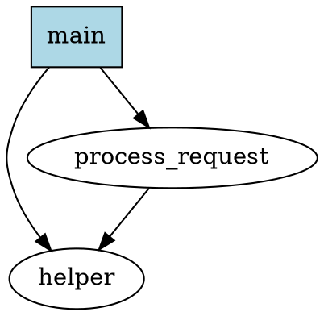

# CallGraphGenerator

A call graph generator tool implemented in Rust that leverages the Language Server Protocol (LSP) to analyze function call relationships in codebases and generates graph files in DOT format.

## Overview

CallGraphGenerator is a tool that automatically extracts function and method call relationships from codebases of various programming languages and generates visual call graphs. By using LSP, it can accurately analyze dynamic call relationships and language-specific syntax that are difficult to handle with static analysis alone.

## Features

- **LSP Integration**: High-precision analysis using Language Server Protocol
- **Multi-language Support**: Supports any language that has an LSP server available
- **DOT Output**: Outputs in DOT format compatible with Graphviz
- **Customizable**: Configurable filtering options and output format adjustments
- **High Performance**: Fast processing powered by Rust

## Usage

### Installation

```bash
git clone https://github.com/yourusername/CallGraphGenerator.git
cd CallGraphGenerator
cargo build --release
```

### Basic Usage

```bash
# Analyze a single file
./target/release/call-graph-generator --file src/main.rs --output callgraph.dot

# Analyze entire project
./target/release/call-graph-generator --project . --output project_callgraph.dot

# Generate call graph starting from a specific function
./target/release/call-graph-generator --file src/main.rs --root main --output main_callgraph.dot
```

### Visualizing DOT Files

Generated DOT files can be converted to images using Graphviz:

```bash
# Output as PNG
dot -Tpng callgraph.dot -o callgraph.png

# Output as SVG
dot -Tsvg callgraph.dot -o callgraph.svg

# Output as PDF
dot -Tpdf callgraph.dot -o callgraph.pdf
```

## Command Line Options

| Option | Description | Default |
|--------|-------------|---------|
| `--file, -f` | Path to a single file to analyze | - |
| `--project, -p` | Root directory of the project to analyze | - |
| `--output, -o` | Path to output DOT file | `callgraph.dot` |
| `--root, -r` | Starting function name for analysis | All functions |
| `--depth, -d` | Maximum call depth to analyze | Unlimited |
| `--exclude` | Package/module patterns to exclude | - |
| `--lsp-server` | LSP server command to use | Auto-detect |
| `--verbose, -v` | Verbose logging output | false |

## Configuration File

You can customize default settings by creating a `callgraph.toml` file in the project root:

```toml
[analysis]
max_depth = 10
exclude_patterns = ["test_*", "*_test"]
include_external = false

[output]
format = "dot"
show_types = true
show_parameters = false
cluster_by_module = true

[lsp]
server_command = "rust-analyzer"
timeout_seconds = 30
```

## Supported Languages

Supports any language for which an LSP server is available. Main supported languages:

- **Rust** (rust-analyzer)
- **Python** (pylsp, pyright)
- **JavaScript/TypeScript** (typescript-language-server)
- **C/C++** (clangd)
- **Java** (jdtls)
- **Go** (gopls)
- **C#** (omnisharp)

## Output Example

Example of generated DOT file:



## Development

### Prerequisites

- Rust 1.70 or later
- LSP server (depending on the target language for analysis)

### Build

```bash
cargo build
```

### Test

```bash
cargo test
```

### Lint

```bash
cargo clippy
```

## Architecture

```
CallGraphGenerator
├── src/
│   ├── main.rs              # Entry point
│   ├── lsp/                 # LSP communication module
│   │   ├── client.rs        # LSP client implementation
│   │   ├── protocol.rs      # LSP protocol definitions
│   │   └── handlers.rs      # Response handlers
│   ├── analyzer/            # Code analysis module
│   │   ├── call_graph.rs    # Call graph construction
│   │   ├── symbol_resolver.rs # Symbol resolution
│   │   └── traverser.rs     # Code traversal
│   ├── output/              # Output module
│   │   ├── dot.rs           # DOT format output
│   │   └── formatter.rs     # Formatter
│   └── config/              # Configuration management
│       ├── cli.rs           # CLI argument parsing
│       └── file.rs          # Configuration file loading
├── tests/                   # Test code
├── examples/                # Usage examples
└── docs/                    # Documentation
```

## Contributing

1. Fork this repository
2. Create a feature branch (`git checkout -b feature/amazing-feature`)
3. Commit your changes (`git commit -m 'Add some amazing feature'`)
4. Push to the branch (`git push origin feature/amazing-feature`)
5. Create a pull request

## License

This project is released under the MIT License. See the [LICENSE](LICENSE) file for details.

## Related Projects

- [rust-analyzer](https://github.com/rust-lang/rust-analyzer) - Rust LSP server
- [Graphviz](https://graphviz.org/) - Graph visualization tool
- [Language Server Protocol](https://microsoft.github.io/language-server-protocol/) - LSP specification
